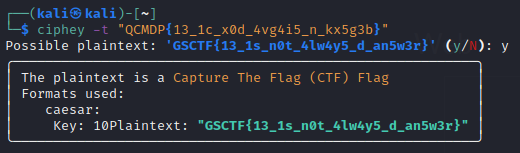

# NOT13

## Description: 
### I hate rotten salad. It makes me sick to my stomach.
### QCMDP{13_1c_x0d_4vg4i5_n_kx5g3b}
---
In this challenge, all we are given is a ambiguous description and what looks like the flag but in an encoded format. From the title and the message recieved against `rot` in the description, it becomes obvious that the encoding is not ROT13. When in doubt as to what the encoding is, I use [ciphey](https://github.com/Ciphey/Ciphey). 

A simple command through the terminal using ciphey gives us the flag. 

As it turns out, the encoding used was ROT10, i.e. the respective characters in the flag were substituted with the 10th character after it.

## Flag:
### GSCTF{13_1s_n0t_4lw4y5_d_an5w3r}