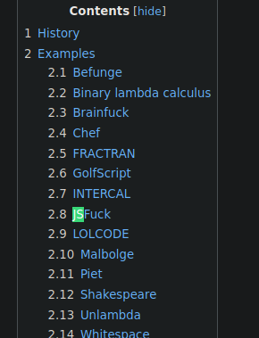
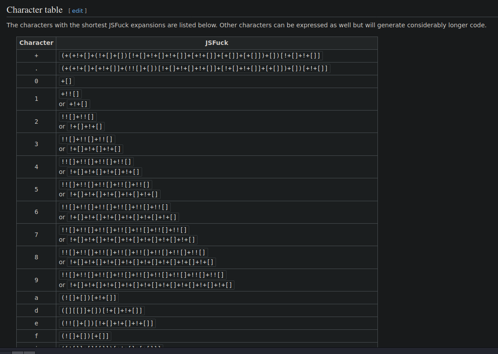
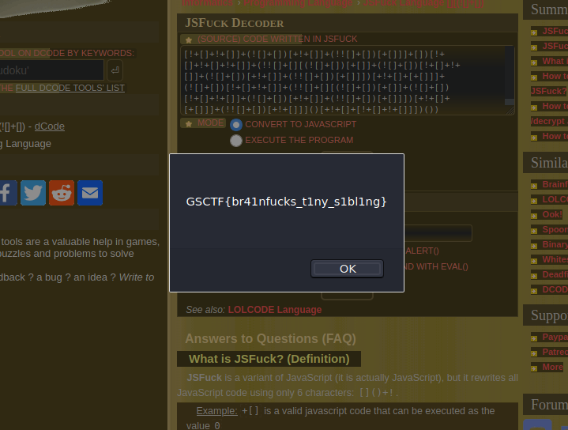

# What the JS?

## Attachments:
### [chal.txt](https://gsctf.bitskrieg.org/files/7c06d7a3f1591d03e575605f79d5780d/chal.txt)

## Hint:
### What is an esosteric language?
---
Seeing the .txt file just left me baffled cus I couldn't make heads or tails of it, but the hint put me back on track. My first instict was to make a websearch for [esosteric languages](https://en.wikipedia.org/wiki/Esoteric_programming_language) and sure enough, that was all that was necessary. 

A quick `ctrl + F` through the wikipedia entry on esosteric languages gave me what I needed.

Although there is a character table given, you would be insane to try and figure it out using that.

So I just passed the characters in the .txt file through a [decoder](https://www.dcode.fr/jsfuck-language) and voila!

---
## Flag:
### GSCTF{br41nfucks_t1ny_s1bl1ng}