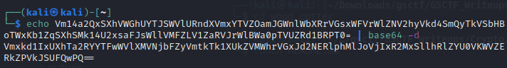
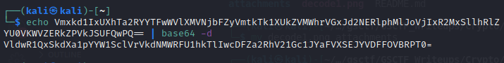
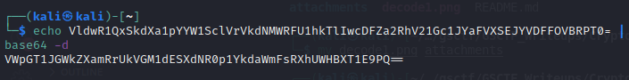
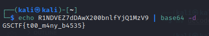

# wood cutter

## Description
### Ono, my cat walked across my keyboard while I was busy cutting logs.
### Vm14a2QxSXhVWGhUYTJSWVlURndXVmxYTVZOamJGWnlWbXRrVGsxWFVrWlZNV2hyVkd4SmQyTkVSbHBoTWxKb1ZqSXhSMk14U2xsaFJsWllVMFZLV1ZaRVJrWlBWa0pTVUZRd1BRPT0=
---
The latter part of the challenge description looked weirdly like base64 and having decoded it, I was disappointed to not get a flag : (

But the output too looks like base64...

Here we see that again, the output looks like base64.

We keep getting base64 outputs but notice that the length of the strings keep decreasing which is a good signal that we are somewhat close to the answer.

Finally, after a couple more repetitions, we get the flag.

---
## Flag:
### GSCTF{t00_m4ny_b4535} 