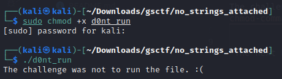
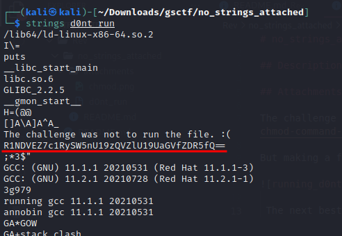
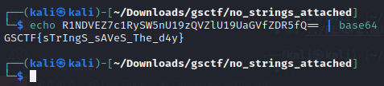

# no_strings_attached

## Description: Can you find the flag in this file without actually running it?

## Attachments: [d0nt_run](https://gsctf.bitskrieg.org/files/086b48d81b6dc603af83f65f7c7876bf/d0nt_run?token=eyJ1c2VyX2lkIjo2MywidGVhbV9pZCI6bnVsbCwiZmlsZV9pZCI6OX0.YaYMqg.mMkECwV3i67W1rcNXkTR7zj5lV4)

The challenge is to find out the flag without running the script. Which means that we are not allowed to use the [chmod](https://www.geeksforgeeks.org/chmod-command-linux/) command and make the file an executable. But it doesn't hurt to try it out ;P

But making the file an executable and running it doesn't help us much as you can see from below.

The next best thing always is to use the [strings](https://www.howtogeek.com/427805/how-to-use-the-strings-command-on-linux/) command.

This time, we get a long string of juicy text.

The line just below the one we got previously when we ran the file as an executable stands out and looks like base64 encoding. 

A simple decoding might fetch us the flag, and sure enough, `strings` for the win.

## Flag: GSCTF{sTrIngS_sAVeS_The_d4y}